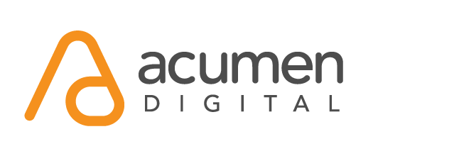

# Intro To React and Redux

---

## Agenda

1. Who Am I
1. Why React
1. What Are We Doing Today
1. Create React App (Facebook Generator Tool)
1. Create Our First React Component
1. Process for Creating Component
1. Homework

---

## Who am I?
charlieblackstock@gmail.com

----

### Charlie Blackstock


----

### Work



----

### Background

Business School @ CU >>> Masteres @ USC >>> Public Accounting for 2 years >>> gSchool >>> Acumen Digial

----

### Coding Background

* Coding for 2.5 years
  * Started learning Ruby with my brother
* Created 40+ React & Redux applications
  * 1 AngularJS & Redux App used by 2+ million users a month
* Taught multiple workshops gSchool students and Galvanize members
* Several workshops for work clients

---

## Why React

* Light-weight front-end framework
  * Writing JavaScript
* Component-Based Architecture
* Declarative
  * Declarative views make your code more predictable and easier to debug.
* Error Handling
  * Incredibly user friendly warning/error messaging

---

## Today's App

** NEED LINK **

---

## Create-React-App
* Facebook's react generator tool
  * [Github Url](https://github.com/facebookincubator/create-react-app)
* Great tool for getting a react app started quickly
* Javascript Fatigue
* Webpack & Babel

----

### Webpack

* Webpack is a module bundler
* Webpack takes modules with dependencies and generates static assets representing those modules
* Goals of Webpack
  * Split the dependency tree into chunks loaded on demand
  * Keep initial loading time low
  * Every static asset should be able to be a module
  * Ability to integrate 3rd-party libraries as modules
  * Ability to customize nearly every part of the module bundler
  * Suited for big projects

----

### Babel

  * Babel is JavaScript compiler
  * Gives the ability to use next gen JavaScript functionality, without the worry if it not working in older browsers

---

## Create a React Component

```javascript
import React from 'react';
import ReactDOM from 'react-dom';

// Create a new Component - this component should produce some HTML
const Component = () => {
  return <div>Im a React Component</div>; // React.createElement()
}

// Take Components rendered HTML and show on DOM
ReactDOM.render(<Component />, document.getElementById('root'));
```

---

## Functional vs. Class Component
* A Functional Component (or a stateless component)
  * Literally a function that takes some info in an some JSX goes out
* A Class Component (or stateful component)
  * Used whenever you need a component to have some internal record keeping
  * Some ability to be aware of itself and what has happened since it was rendered
  * Ex. a component with an `<input />` would typically need to keep track of what the user has entered into the `<input />` element

---

##  What is State?

* State is a plain JavaScript object that is used to **record** and **react** to user events
* Each component has its own state object
* Whenever a component state is changed the component re-renders and causes its children to re-render

---

## A Class Component

```javascript
// assume the necessary import statements are listed above
class SearchBar extends Component {
    constructor(props) {
      super(props);

      this.state = { term: '' };
    }

    render() {
      return (
        <input
          value={this.state.term}
          onChange={event => this.setState({term: event.target.value})}
          />
      );
    }
}
```
Note: constructor function is a part of all JS classes.  It is the first function called for each instance of the class.  constructor is reserved for doing some setup inside of our class (like initializing variables, initializing state, etc...).  Super calls the parent method on a parent class.

---
